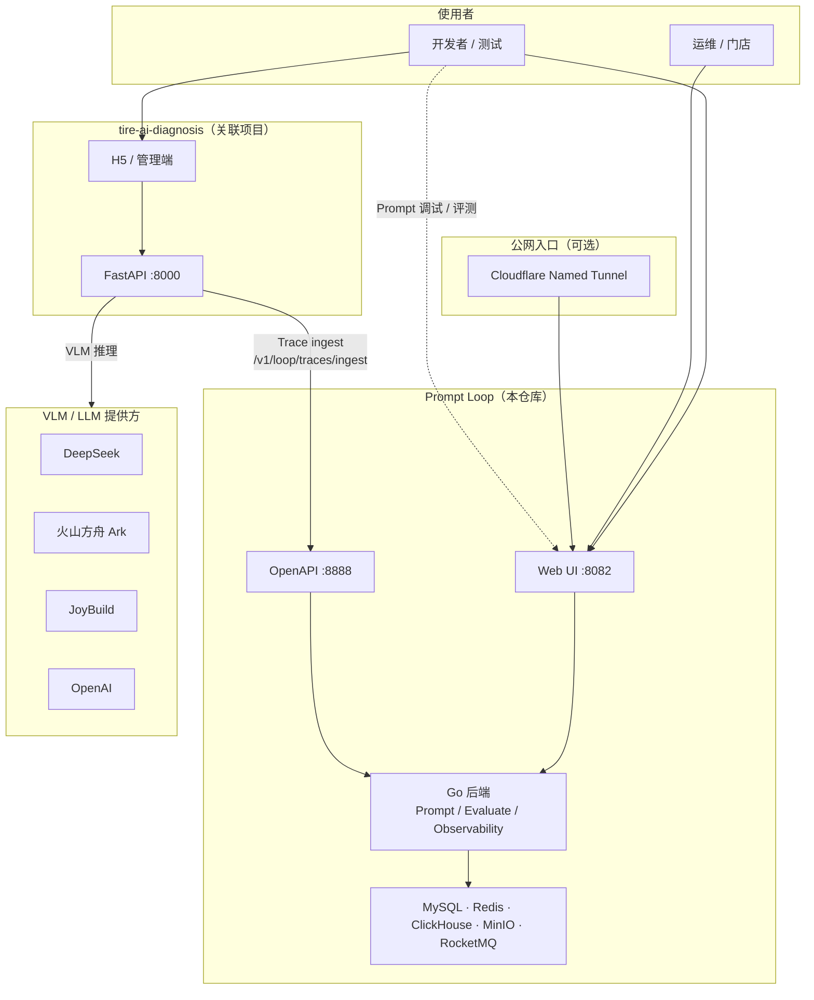
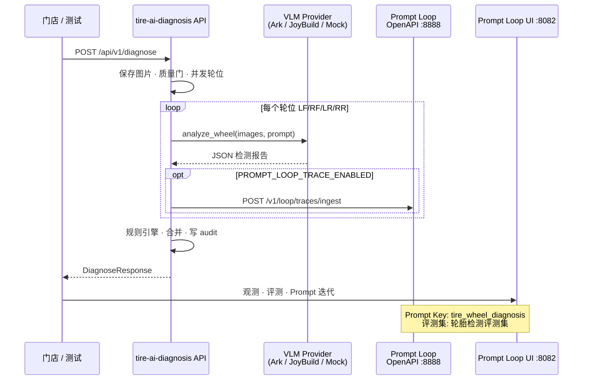
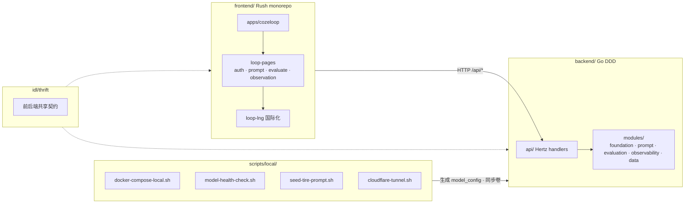
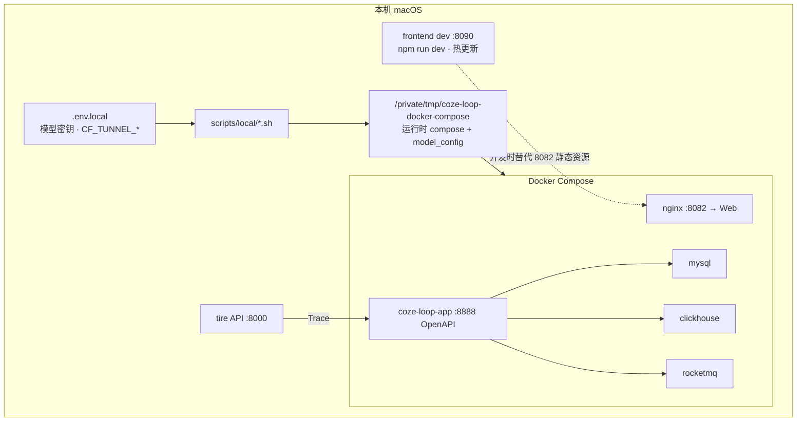
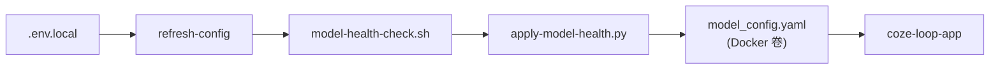

# Prompt Loop 架构图

本文描述 **Prompt Loop**（本仓库对 Coze Loop 的开源 fork）与关联项目 **tire-ai-diagnosis** 的整体架构、数据流与本地部署拓扑。

> 上游单体仓库内部结构见 [ARCHITECTURE.md](../../ARCHITECTURE.md)。本文聚焦 fork 定制与轮胎检测集成场景。

---

## 1. 系统上下文



| 组件 | 职责 |
|------|------|
| **Prompt Loop Web** | Prompt 编写调试、评测实验、Trace 观测、PAT 管理 |
| **Prompt Loop OpenAPI** | SDK / 外部服务接入（Trace、Prompt、评测 OpenAPI） |
| **tire-ai-diagnosis API** | 轮胎拍照诊断编排：上传 → 多轮位 VLM → 规则引擎 → 报告 |
| **VLM 提供方** | 实际多模态推理；Prompt Loop 平台内模型用于 Playground / PTaaS |

---

## 2. 轮胎检测端到端数据流



**Prompt 与评测资产**（由 `scripts/local/seed-tire-prompt.sh` 导入）：

| 资产 | 标识 |
|------|------|
| Prompt | Key `tire_wheel_diagnosis`，版本 `0.0.1` |
| 评测集 | 名称 `轮胎检测评测集`，5 条样例 |

tire API 侧 VLM Prompt 目前由 `pipeline/prompts.py` 维护；Prompt Loop 中的模板用于平台内调试、评测与版本管理，Trace 上报便于在观测页对比线上 VLM 行为。

---

## 3. Prompt Loop 内部模块（简图）



品牌改造主要落在 **frontend** 的 UI 文案、Logo、登录页与部分 i18n；**npm 包名**（`@cozeloop/*`、`@coze-arch/*`）与 **CSS 变量**（`--coze-*`）仍与上游一致，避免大规模依赖重命名。

---

## 4. 本地部署拓扑



| 端口 | 服务 | 说明 |
|------|------|------|
| **8082** | Prompt Loop Web（Docker nginx） | 预构建镜像，UI 改动需 dev 8090 或 rebuild |
| **8888** | Prompt Loop OpenAPI | Trace ingest、SDK 调用 |
| **8090** | 前端 dev server | `cd frontend/apps/cozeloop && npm run dev` |
| **8000** | tire-ai-diagnosis API | 独立仓库，本地联调 |

---

## 5. 模型与配置流



| Provider | 典型 env | 本地状态（示例） |
|----------|-----------|------------------|
| DeepSeek | `DEEPSEEK_API_KEY` | 推荐默认可用 |
| OpenAI | `OPENAI_API_KEY` | 易遇 quota 超限 |
| Ark | `ARK_API_KEY` | 需账户余额 |
| JoyBuild | `JOYBUILD_API_KEY` | 待接入 API Key |

健康检查失败的模型会被标记 `prompt_debug.unavailable: true`，避免 Playground 默认可选已失效模型。

---

## 6. Trace 集成契约

外部服务（如 tire API）上报 Trace 的最小约定：

| 项 | 值 |
|----|-----|
| 端点 | `POST {PROMPT_LOOP_OPENAPI_URL}/v1/loop/traces/ingest` |
| 鉴权 | `Authorization: Bearer {PAT}` |
| Span 类型 | `span_type: "model"`，轮位级 Span |
| 环境变量 | `PROMPT_LOOP_WORKSPACE_ID`、`PROMPT_LOOP_API_TOKEN` |

生成 smoke 用 PAT：`bash scripts/local/create-smoke-pat.sh`

---

## 7. 仓库关系

```text
ClaireWong86/Draft-Design          ← Prompt Loop fork（本仓库）
        │
        ├── examples/tire-ai-diagnosis/   样例 Prompt + 评测集
        ├── scripts/local/                本地运维脚本
        └── docs/prompt-loop/             本文档目录

~/Projects/tire-ai-diagnosis       ← 轮胎检测应用（独立 git）
        └── services/api/
              ├── clients/prompt_loop_trace.py
              └── pipeline/diagnose.py
```

---

## 相关文档

- [Runbook 一页纸](./runbook.md)
- [Contributing 补充](./contributing.md)
- [本地 Docker 指南](../guidance/local-macos-docker.md)
- [轮胎场景 README](../../examples/tire-ai-diagnosis/README.md)
